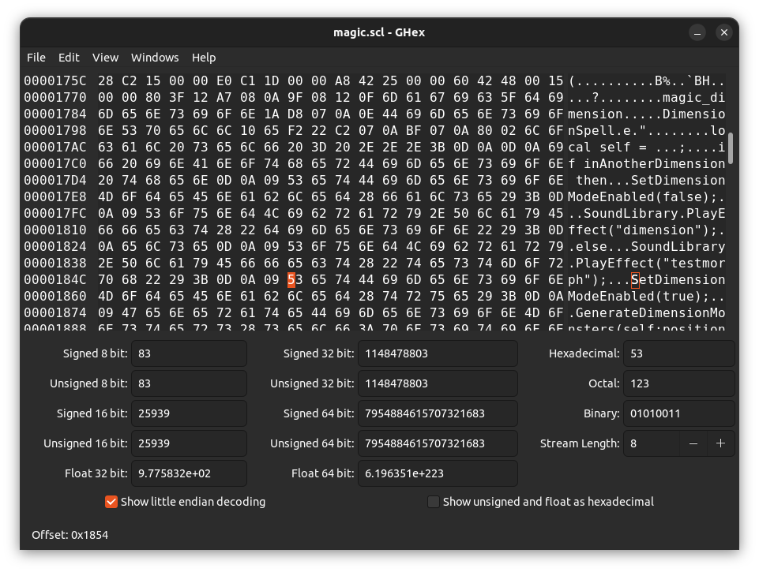
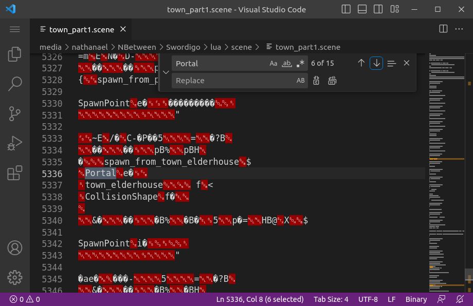

# Swordigo Chunk Overwrite Modding Guide

## By Daniel Spaniel

> This guide is a markdown file. To view it properly use a markdown viewer like one of [these](https://github.com/mundimark/awesome-markdown-editors).

## Introduction

Current Swordigo code modding tech is very limited, and a lot of work is required before we will know how to mod the inner workings of the game. But for now, it is very simple to mod certain code. This includes code for things such as cutscenes and mob behaviour, but can sometimes extend to other areas, such as magic spells.

More specifically, this guide will show you how to edit Lua Chunks contained within any ```.scene``` and ```.scl``` files.

The method I use is very simple. It is done by simply overwriting any existing code while keeping chunks the same length, hence the name I have for this tech, Chunk Overwrite.

Learning to use chunk overwrite is very easy, and will be covered in the first section. The difficult part is writing the code correctly, using the available functions, which will be addressed in the second section.

To use this method, it is not required, but very useful to know the basics of some programming or scripting language, especially Lua, as this is the language used for the game. Personally, I have only learned Python and c++, and I get along just fine with a few internet searches to understand differences in syntax.

## Section 1 : Overwriting

Since ```.scene``` and ```.scl``` files are binary files, which means they are not plain text, you cannot edit them using a conventional text editor as the file will become corrupted. Instead, a hex editor should be used.

Some popular hex editors for Windows include:

- HxD Hex Editor
- 010 Editor
- Free Hex Editor Neo

Some options for MacOS are:

- HexED.it
- Hex Fiend
- UltraEdit

And for Linux:

- Bless Hex Editor
- Okteta
- Ghex (my choice)

For Android there's basically only one, and it's just called Hex Editor.
And if you're on IOS you can't really do Swordigo modding anyway.

---

The first step is to find the code you want to overwrite. With current tech, it isn't really possible to change when or how your code is executed in the game. For example you can change the code for a cutscene, but you can't reposition the cutscene trigger. If you want to change something like the behaviour of a mob, a bossfight, or a cutscene, you can find the appropriate code chunks in their files.

> For mob behaviour look in ```monsters.scl```, for Hiro's Master's dialogues look in ```master.scl``` and so on. Cutscenes can be found in the correct ```.scene``` files.
> In order to locate the correct scene files, it can help to look through ```test.scmap```.

If you want to add code that can be executed at any time and in any level the only solution is to edit the magic spells in ```magic.scl```.

While looking through the files to find the correct code you will notice that most of the content of the files is unreadable and looks like garbage. Don't worry about this stuff, it just means you have to scroll a long way to find any useful code. You might also notice that all the chunks are repeated three times, the second one having a different beginning and the third being compiled. Don't worry about this either, you only need to edit the first version as the others aren't used.

---

Once you have found your chunk you can edit it however you like, with one limitiation which is that you have to keep the chunk the same length. The best way to do this is to replace the characters in the file rather than adding or removing them. If your code is a different length than the original code, you can just fill in the rest of the chunk with space characters. If your code is any longer, it's just too bad. Try and keep your code as small and concise as possible.

To add new lines to your code using the hex editor, you will likely have to do this differently than how you would in a regular text editor. In ghex, which the program I use, you can move the cursor to the hex pane using the tab key and typing the correct characters in hexadecimal, but the method will likely be different on different hex editors.

To add line breaks you have to add these characters:

```
0D 0A
```

If you want to use indentation you have to add tab characters like this:

```
0D 0A 09
```

As shown in image 1, just to the left of the cursor.

---



---

After editing, just save the file and check that the file size has not changed.

## Section 2 : Functions

When writing code in Swordigo, we have to work within some strict limitations. One of them is the functions that are available to us; we can use only the built-in functions that are included in the game engine, as well as those that are part of the Lua language.

In this section I will show you all the functions I know of, with examples of their correct usage. I will continue to update this section as I discover new ones.

## Program

### Program.Wait

```
Program.Wait(time);
```

Wait for a specific period of time, where time is the number of seconds. The time can be an int or float. you can also use a function which returns an int or float.

Examples:

```
Program.Wait(2.5);
```
```
Program.Wait(KeyframeAnimation.TimeToCompletion(self, attackAnimation));
```

### Program.Execute

---

```
Program.Execute(object, action);
```

Execute an action. I'm not exactly sure what this function does. I think it just activates some built-in behaviour of an object, for instance to open a gate, or it just makes the object do an animation. Note that you don't have to specify the action if the object only has one action.

Examples:

```
Program.Execute(Scene.Find("magedoor"));
```

This opens a door.

```
Program.Execute(Scene.Find("elevator"), 110);
```

This makes the forgotten keep's elevator go down.

### Program.SetKeepActive

---

```
Program.SetKeepActive(true);
```

This function is only used in one scene (florennum_jail_boss), so it is probably not necessary. It seems to force the scene to continue to use an entity as the active object where true is a boolean stating whether or not the entity should remain active.

Examples:

```
Program.SetKeepActive(false);
```


## Game

### Game.ShowNotification

---

```
Game.ShowNotification(message);
```

Show a notification, where message is a string, int or float.

Examples:

```
Game.ShowNotification("Sorry Hiro, the Mageblade is in another castle.");
```
```
Game.ShowNotification(Scene.Find("hero"):position():x());
```

### Game.Flash

---

```
Game.Flash()
```

Make the screen flash white. This is the effect used for when a magic bomb explodes.

### Game.FadeOut

---

```
Game.Fadeout(time);
```

Fades the screen to black, where time is an optional int or float that defines how long it takes to fade out. If you don't specify the time it defaults to about 1 second.

Examples:

```
Game.Fadeout(4);
```

Takes 4 seconds to fade out.

### Game.FadeIn

---

```
Game.FadeIn();
```

Same as Game.FadeOut, but fades from black to full brightness. This is required after fading out, or else the screen stays black.

### Game.SetCimematicMode

---

```
Game.SetCinematicMode(bool1, bool2);
```

Changes whether or not the game is in cinematic mode. In cinematic mode, the controls disappear and pauses the scene. The first boolean is whether or not the game should be in cinematic mode and i'm not sure what the second boolean does. Usually the two booleans are opposite values.

Examples:

```
Game.SetCimematicMode(true, false);
```

Turns on cinematic mode.

```
Game.SetCimematicMode(false, true);
```

Turns off cinematic mode.

### Game.EnterPortal

---


```
Game.EnterPortal(level, spawnpoint);
```

Teleport to any spawnpoint in any level.
The level name is just the scene file name without the file extension, for example to load town_elderhouse.scene use "town_elderhouse".
You can find spawnpoints in scenes by looking through scenes and searching for the word "Portal" as shown in image 2. Every level has a default spawn called "spawn_default".



Examples:

```
Game.EnterPortal("town_healer_house", "spawn_from_resurrection");
```

Spawns you in the Cairnwood Village healer's house in the spot where you spawn after passing out in the woods.

```
Game.EnterPortal("plains_woodkeep_cellar", "spawn_default");
```

Spawns you in the Cellar of the forgotten keep at the default spawnpoint.

### Game.IncCounter

---

```
Game.IncCounter(counter);
```

Increments a counter in the game, where counter is the name of a counter as a string. I don't know how to make counters, possibly if you reference a counter that does not exist it will be automatically generated.
It is mostly used for achievements.

Examples:

```
Game.IncCounter("pancaketime");
```

Stores the fact that you got the Pancake Time achievement.

### Game.SetDefaultMusicName

---

```
Game.SetDefaultMusicName(music);
```

I'm not sure why this function exists, since there is already MusicPlayer.PlayMusic(), but it just seems to play a track where music is the name of a track.

Examples:

```
Game.SetDefaultMusicName("menu");
```

Plays the menu music.

## Scene

### Scene.Find

```
Scene.Find(entity);
```

Probably the most common function. It finds any entity in the current scene by entity name where entity is the name of the entity to find. It can be used to execute an action on an entity or to set a variable equal to an entity. It is useful to set an entity as the value of a variable if you want to use that entity a lot in your chunk to save space.

Examples:

```
local hero = Scene.Find("hero");
```

Declare a var hero and set it equal to the hero entity for later use.

```
Scene.Find("hero"):setPosition(Vector3.New(100,23,1038));
```

Set the position of the hero to a new 3d vector.

```
Scene.Find("trapbat2"):setHidden(False);
```

Unhide the entity named "trapbat"

```
Camera.FocusAtShape(Scene.Find("focusArea"), Rectangle.New(0,0,0,0));
```

Focus the camera at a focus area.

### Scene.CreateObject

```
Scene.CreateObject(entity, name, position);
```

Another very useful function. It adds a new object to the scene where entity is the type of entity to add, name is the a custom name to assign it and position is an optional object to spawn it next to. Note that position cannot be a vector, it must be the name of an object (i think). Usually the new object is assigned to a variable. It seems to help if the name you give the entity is different from its type. If you assign the object to a variable, you can reference it by the variable name, otherwise you must reference it using ```Scene.Find```

Examples:

```
local sword = Scene.CreateObject("item_brasssword", "brasssword", Scene.Find("sword_npc"));

sword:setHidden(true);
```

Make a new brass sword entity at the position of the entity named "sword_npc", naming it "brasssword", and set it as the value of the variable "sword", then hide it.

```
local nugget = Scene.CreateObject("nugget_mana", "mananugget");

Scene.Find("mananugget"):setPosition(hero:position) + Vector3.New(100, 20, 0);
```

Make a new energy orb and set its position to right next the hero's position. Note the use of ```Scene.Find``` rather than using the variable

createobject

addobject

setpaused

## Character

### Character.AddItem

---


```
Character.AddItem(itemname);
```

Adds an item to your inventory, where itemname is the name of the item to add. The pickup animation will be played if required.

Examples:

```
Character.AddItem("key_yellow");
```

Gives you a key.

### Character.RemoveItem

---

```
Character.RemoveItem(itemname);
```

Same as Character.AddItem, but removes the item from your inventory.

### Character.HasItem

---

```
Character.HasItem(itemname);
```

Returns true if you have the item, false otherwise, where itemname is the name of the item to check for.

Examples:

```
if Character.HasItem("brasssword") then
```
Runs the code that on the next line only if you have the Brass Sword.

### Character.AddSkill

---

```
Character.AddSkill(skill);
```

Gives you a magic spell, where skill is the name of the spell. A notification is shown with the name of the spell. The names of the spells in the game are, in order:

- "bolt" (Magic Bolt)
- "bomb" (Magic Bomb)
- "hookshot" (Dragon's Grasp)
- "dimension" (Dimensional Rift)

Examples:

```
Character.AddSkill("bomb");
```

Gives you the Magic Bomb spell.

### Character.HasSkill

---

```
Character.HasSkill(skill);
```

Same as Character.HasItem but for spells

### Character.SetNumCoins

---

```
Character.SetNumCoins(coins);
```

Sets the amount of soul shards you have where coins is the number to set it to as an int. The coin display will slowly increment until it matches the amount.

### Character.NumCoins

---

```
Character.NumCoins();
```

Returns the number of soul shards you currently have.

Examples:

```
Character.SetNumCoins(  Character.NumCoins()  +  20);
```

Gives you another twenty soul shards

```
Character.SetNumCoins(240);
```

Sets your soul shards to 240.

### Character.HasQuest

---

```
Character.HasQuest(questname);
```

Returns ```true``` if you have been given the quest, false otherwise, where questname is the name of the quest to check for as a string.

Examples:

```
if Character.HasQuest("quest01_find_master") then
```

Runs the code on the next line only if you have been given the quest to find the master in the woods.

### Character.IsQuestInProgress

---

```
Character.IsQuestInProgress();
```

Same as Character.HasQuest, but only returns true if you have not completed the quest, so it is still in progress.

Examples:

```
if Character.IsQuestInProgress("quest09_assemble") then
```

Runs the code on the next line only if you are currently in the quest to assemble the Mageblade.

### Character.AddQuest

---

```
Character.AddQuest(questname);
```

Gives you a quest, where quest name is the quest to give. A notification is shown with the quest name.

### Character.SetQuestCompleted

---

```
Character.SetQuestCompleted(questname);
```

Sets the status of quest to completed, where questname is the name of the quest to complete. A notification is displayed with the quest name.

Examples:

```
Character.SetQuestCompleted("quest072_ice");
```

Sets the quest to go to the Snowy Peaks to completed.

### Character.AddFlag

---

```
Character.AddFlag(flag);
```

Adds a flag to the character where flag is the name of the flag to add as a string. A flag is used to store the fact that some action has taken place, for instance that a door has been opened.
Flags can be checked for with ```Character.HasFlag```.

Examples:

```
Character.AddFlag("treasure_collected");
```

Remember that the player has collected some treasure.

```
Character.AddFlag(Scene.Find("magedoor"):identifier());
```

Store that the player has opened the Mage Door.

### Character.HasFlag

---

```
Character.HasFlag(flag);
```

Returns true if the given flag has been added with ```Character.AddFlag```, false otherwise. Used to check if an action has already taken place, for instance if a door has been opened.

Examples:

```
if Character.HasFlag("magic_sword_door_opened") then
```

runs the code on the next line only if the player has opened the Magic Sword door.

### Character.AddSceneFlag

```
Character.AddSceneFlag(flag);
```

Same as ```Character.AddFlag```, but scene specific, which means that if the player has a scene flag for one level, they will not have that scene flag when in another level.

### Character.HasSceneFlag

```
Character.HasSceneFlag(;)
```

Same as ```Character.HasFlag```, but scene specific, which means that if the player has a scene flag for one level, they will not have that scene flag when in another level.

### Character.RegisterTreasure

```
Character.RegisterTreasure(chest);
```

I'm not sure what this function does, but it is called when a chest is loaded, where chest is the chest object to register.

### Character.RegisterTreasureCollection

```
Character.RegisterTreasureCollection(chest);
```

Register and remember that a chest has been opened and the contents have been collected, where chest is the chest object to remember. The chest that is passed to the function still be opened when the scene is reloaded, and a star will appear on the map.

### Character.AddQuestText


### Program.Print

## AnimationController
## Camera
## CharacterController
## CollectibleItem
## CollisionShape
## Entity
## EntityController
## Health
## ItemDrop
## KeyFrameAnimation
## Light
## ModelTransformController
## MusicPlayer
## ParticleEmitter
## Properties
## PhysicsObject
## SoundLibrary
## TransformController
## TextBubble


## Self

### :addComponent
### :clone
### :destroy
### :identifier
### :position
### :setHidden
### :setPosition
### :setVelocity