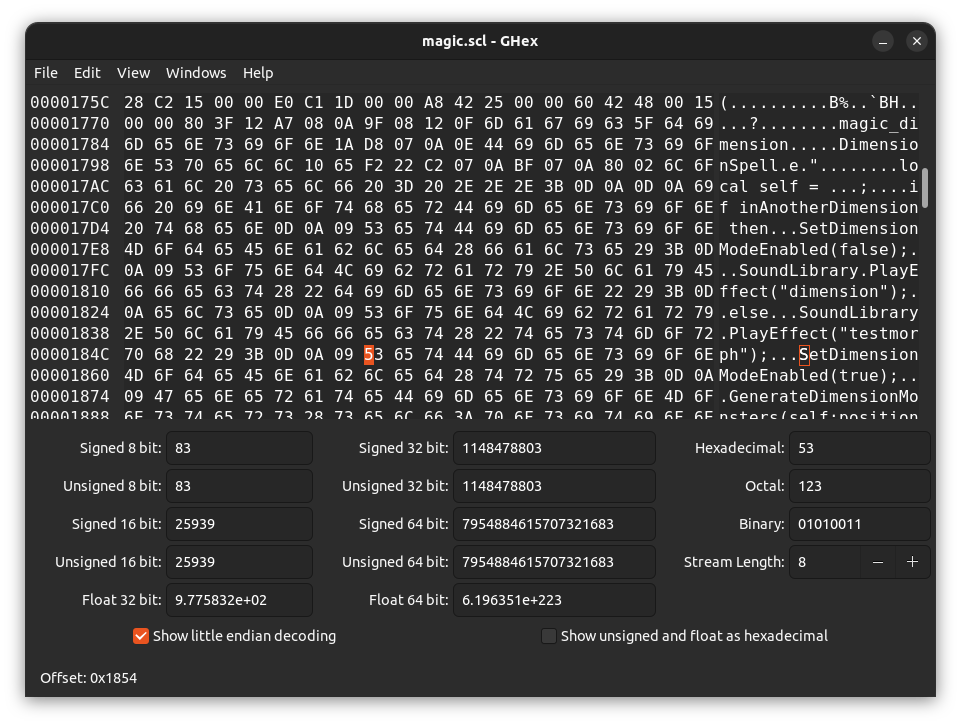
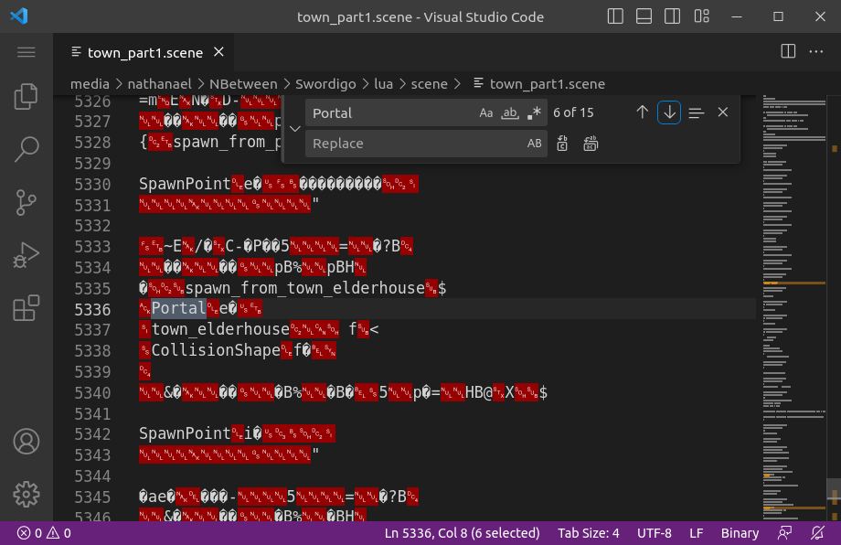

# Swordigo Chunk Overwrite Modding Guide

## By Daniel Spaniel

> This guide is a markdown file. To view it properly use a markdown viewer like one of [these](https://github.com/mundimark/awesome-markdown-editors).

## Introduction

Current Swordigo code modding tech is very limited, and a lot of work is required before we will know how to mod the inner workings of the game. But for now, it is very simple to mod certain code. This includes code for things such as cutscenes and mob behaviour, but can sometimes extend to other areas, such as magic spells.

More specifically, this guide will show you how to edit Lua Chunks contained within any `.scene` and `.scl` files.

The method I use is very simple. It is done by simply overwriting any existing code while keeping chunks the same length, hence the name I have for this tech, Chunk Overwrite.

Learning to use chunk overwrite is very easy, and will be covered in the first section. The difficult part is writing the code correctly, using the available functions, which will be addressed in the third section.

To use this method, it is not required, but very useful to know the basics of some programming or scripting language, especially Lua, as this is the language used for the game. Personally, I have only learned Python and c++, and I get along just fine with a few internet searches to understand differences in syntax.

## Section 1 : Overwriting

Since `.scene` and `.scl` files are binary files, which means they are not plain text, you cannot edit them using a conventional text editor as the file will become corrupted. Instead, a hex editor should be used.

Some popular hex editors for Windows include:

- HxD Hex Editor
- 010 Editor
- Free Hex Editor Neo

Some options for MacOS are:

- HexED.it
- Hex Fiend
- UltraEdit

And for Linux:

- Bless Hex Editor
- Okteta
- Ghex (my choice)

For Android there's basically only one app, and it's just called Hex Editor. I would recommend the web hex editor [HexEd.it](hexed.it).
And if you're on IOS you can't really do Swordigo modding anyway.

---

The first step is to find the code you want to overwrite. With current tech, it isn't really possible to change when or how your code is executed in the game. For example you can change the code for a cutscene, but you can't reposition the cutscene trigger.

If you want to change something like the behaviour of a mob, a bossfight, or a cutscene, you can find the appropriate code chunks in their files.

> For mob behaviour look in `monsters.scl`, for Hiro's Master's dialogues look in `master.scl` and so on. Cutscenes can be found in the correct `.scene` files.
> In order to locate the correct scene files, it can help to look through `test.scmap`.

If you want to add code that can be executed at any time and in any level the only solution is to edit the magic spells in `magic.scl`.

While looking through the files to find the correct code you will notice that most of the content of the files is unreadable and looks like garbage. Don't worry about this stuff, it just means you have to scroll a long way to find any useful code. You might also notice that all the chunks are repeated three times, the second one having a different beginning and the third being compiled (as shown below). Don't worry about the middle one, the first one is for 64-bit devices, and the third one is for 32-bit. It is very difficult to change the code in the third one, so probably just edit the first.


---

Once you have found your chunk you can edit it however you like, with one limitiation which is that you have to keep the chunk the same length. The best way to do this is to replace the characters in the file rather than adding or removing them. If your code is a different length than the original code, you can just fill in the rest of the chunk with space characters (as shown below). If your code is any longer, it's just too bad. Try and keep your code as small and concise as possible.


To add new lines to your code using the hex editor, you will likely have to do this differently than how you would in a regular text editor. In ghex, which the program I use, you can move the cursor to the hex pane using the tab key and typing the correct characters in hexadecimal, but the method will likely be different on different hex editors.

To add line breaks you have to add these characters:

```
0D 0A
```

If you want to use indentation you have to add tab characters like this:

```
0D 0A 09
```

As shown in image 1, just to the left of the cursor.

---



---

After editing, just save the file and check that the file size has not changed.


## Section 2 : Concepts

In this section I will attempt to explain some important concepts to understand. It's very handy to have an understanding of how the game works, and it makes it easier to understand the code as well.

### Scenes

All of Swordigo's different levels or areas are called scenes. Each scene is contained in a ``.scene`` file. For example Cairnwood Village is contained in ``town_part1.scene``.

A scene file contains :

- Directional lighting e.g. bright sunlight for the plains area.
- A background image
- One or more ground meshes
- Entities
- Objects

### Objects

An object is something with a 3D model that can be placed somewhere in a scene, things like trees, houses, items and platforms. An object will have a few [Components](###Components), usually one or more CollisionShapes, a PhysicsObject component and a TransformController component. They can have other components as well, such as BreakableObject and Program.

### Entities

An entity is an object in a scene that can walk. This includes the player, npcs, mobs and bosses. An entity will usually have components like EntityInfo, KeyframeAnimation, AnimationController, Damage (if it attacks), Health and one or more CollisionShapes. They may also have a Program component. Monster entities sometimes have monster controller components such as ChargingMonsterController, SnappingMonsterController (for snappers) or WalkingMonsterController.

### Identifiers

Every object has an identifier, which is a name that is usually unique to that object. Objects are assigned an identifier either when they are made using [Scene.CreateObject](###Scene.CreateObject) or when they are defined in a scene file. You can reference an object by its identifier using [Scene.Find](###Scene.Find) as shown below.

```lua
local object = Scene.Find("identifier");
```


### Components

All objects and entities have at least one component, which will define how it behaves and how it can be controlled or handled. Some components allow for objects to be controlled in different ways by the code. For example: if an object has a TransformController component it can be re-positioned with [TransformController.TranslateTo](###TransformController.TranslateTo) and rotated with [TransformController.RotateTo](###TransformController.RotateTo), or if it has an AnimationController component you can start an animation using [AnimationController.BlendToAnimation](###AnimationController.BlendToAnimation). So components basically allow you to control objects and entities in different ways using code.

> See [Component-List](##Component-List) for a list of all components.


### Vectors

A vector is a essentially a set of coordinates, with three values, for the x, y and z axes. Vectors are used to store the position and rotation of objects in the scene. You can make a vector using the `Vector3.New` function as shown below.

```lua
local vector = Vector3.New(200, -30, 0);
```

You can also get the position of an entity as a vector using the `Position` function like this:

```lua
local vector = Scene.Find("hero"):position() -- get Hiro's position
```

More on these functions can be found in [Section 3 : Functions](##Section 3 : Functions).

## Section 3 : Functions

When writing code in Swordigo, we have to work within some strict limitations. One of them is the functions that are available to us; we can use only the built-in functions that are included in the game engine, as well as those that are part of the Lua language.

In this section I will show you all the functions I know of, with examples of their correct usage. I will continue to update this section as I discover new ones.


## AnimationController

### AnimationController.BlendToAnimation

---

```lua
AnimationController.BlendToAnimation(identifier, animation)
```

Starts an animation. Pass it the identifier of the entity and the name or number of the animation. The entity will continue to perform the animation until another animation is started. See [KeyFrameAnimation](### KeyFrameAnimation) for more info on animations.

## Camera

### Camera.Rumble()

---

Makes the camera shake. This is the effect used when for example a crusher hits the ground or a magmatar throws a projectile.


### Camera.FocusAtShape

---

```lua
Camera.FocusAtShape(object, rect);
```

Focuses the camera at an object. This may have to be a specific type of object, and it is usually a focus area or focus point. Pass it an object using its variable name or the Scene.Find function. Optionally, you can pass it a rectangle, I don't know how rectangles work but I think they let you adjust the camera's zoom.

Examples:

```lua
Camera.FocusAtShape(Scene.Find("focusArea2"));
```

### Camera.FocusAtPoint

---

Like ```Camera.FocusAtShape```, but you pass it a position instead of an object. You can pass a position using the ```Vector3.New``` Function, or get the position of an object.

Examples:

```lua
Camera.FocusAtPoint(self, Vector3.New(-150, 250, 0)); -- focus at these coordinates
```

```lua
Camera.FocusAtPoint(Scene.Find("hero"):position() + Vector3.New(50, 0, 0)) -- focus to the right of the player
```


### Camera.JumpToFocus

---

This function is always used along with ``Camera.FocusAtShape`` or ``Camera.FocusAtPoint`` or ``FocusAtPointAndWait``, and I think it's because these functions don't immediately move the camera to focus at the object.

### Camera.ResetFocus

---

Reset the focus to follow the player as normal. You can use this, for example, after a cutscene.

### Camera.IsPointVisible

---

Returns true if a point is visible on screen, false otherwise.

Examples:

```lua
while not Camera.IsPointVisible(Scene.Find(newObject:position())) do Program.Wait(0.2) end -- wait until newObject is visible.
```

### Camera.FollowShape

---

```lua
Camera.FollowShape(object, rect)
```

Makes the camera automatically follow a moving object. You can pass it a rectangle just like with ``Camera.FocusAtShape``.

## Character

### Character.AddItem

---


```lua
Character.AddItem(itemname);
```

Adds an item to your inventory, where itemname is the name of the item to add. The pickup animation will be played if required.

Examples:

```lua
Character.AddItem("key_yellow");
```

Gives you a key.

### Character.RemoveItem

---

```lua
Character.RemoveItem(itemname);
```

Same as Character.AddItem, but removes the item from your inventory.

### Character.HasItem

---

```lua
Character.HasItem(itemname);
```

Returns true if you have the item, false otherwise, where itemname is the name of the item to check for.

Examples:

```lua
if Character.HasItem("brasssword") then
```
Runs the code that on the next line only if you have the Brass Sword.

### Character.AddSkill

---

```lua
Character.AddSkill(skill);
```

Gives you a magic spell, where skill is the name of the spell. A notification is shown with the name of the spell. The names of the spells in the game are, in order:

- "bolt" (Magic Bolt)
- "bomb" (Magic Bomb)
- "hookshot" (Dragon's Grasp)
- "dimension" (Dimensional Rift)

Examples:

```lua
Character.AddSkill("bomb");
```

Gives you the Magic Bomb spell.

### Character.HasSkill

---

```lua
Character.HasSkill(skill);
```

Same as Character.HasItem but for spells

### Character.SetNumCoins

---

```lua
Character.SetNumCoins(coins);
```

Sets the amount of soul shards you have where coins is the number to set it to as an int. The coin display will slowly increment until it matches the amount.

### Character.NumCoins

---

```lua
Character.NumCoins();
```

Returns the number of soul shards you currently have.

Examples:

```lua
Character.SetNumCoins(  Character.NumCoins()  +  20);
```

Gives you another twenty soul shards

```lua
Character.SetNumCoins(240);
```

Sets your soul shards to 240.

### Character.HasQuest

---

```lua
Character.HasQuest(questname);
```

Returns ```true``` if you have been given the quest, false otherwise, where questname is the name of the quest to check for as a string.

Examples:

```lua
if Character.HasQuest("quest01_find_master") then
```

Runs the code on the next line only if you have been given the quest to find the master in the woods.

### Character.IsQuestInProgress

---

```lua
Character.IsQuestInProgress(questname);
```

Same as Character.HasQuest, but only returns true if you have not completed the quest, so it is still in progress.

Examples:

```lua
if Character.IsQuestInProgress("quest09_assemble") then
```

Runs the code on the next line only if you are currently in the quest to assemble the Mageblade.

### Character.IsQuestCompleted

---

```lua
Character.IsQuestCompleted(questname)
```

Runs the code on the next line only if you have completed the quest.

### Character.AddQuest

---

```lua
Character.AddQuest(questname);
```

Gives you a quest, where quest name is the quest to give. A notification is shown with the quest name.

### Character.SetQuestCompleted

---

```lua
Character.SetQuestCompleted(questname);
```

Sets the status of quest to completed, where questname is the name of the quest to complete. A notification is displayed with the quest name.

Examples:

```lua
Character.SetQuestCompleted("quest072_ice");
```

Sets the quest to go to the Snowy Peaks to completed.

### Character.AddFlag

---

```lua
Character.AddFlag(flag);
```

Adds a flag to the character where flag is the name of the flag to add as a string. A flag is used to store the fact that some action has taken place, for instance that a door has been opened.
Flags can be checked for with ``Character.HasFlag``.

Examples:

```lua
Character.AddFlag("treasure_collected");
```

Remember that the player has collected some treasure.

```lua
Character.AddFlag(Scene.Find("magedoor"):identifier());
```

Store that the player has opened the Mage Door.

### Character.HasFlag

---

```lua
Character.HasFlag(flag);
```

Returns true if the given flag has been added with ``Character.AddFlag``, false otherwise. Used to check if an action has already taken place, for instance if a door has been opened.

Examples:

```lua
if Character.HasFlag("magic_sword_door_opened") then
```

runs the code on the next line only if the player has opened the Magic Sword door.

### Character.AddSceneFlag

```lua
Character.AddSceneFlag(flag);
```

Same as ``Character.AddFlag``, but scene specific, which means that if the player has a scene flag for one level, they will not have that scene flag when in another level.

### Character.SetSceneFlag

---

```lua
Character.SetSceneFlag(flag)
```

Same as ``Character.AddSceneFlag``, as far as I can see.

### Character.HasSceneFlag

```lua
Character.HasSceneFlag(;)
```

Same as ```Character.HasFlag```, but scene specific, which means that if the player has a scene flag for one level, they will not have that scene flag when in another level.

### Character.RegisterTreasure

```lua
Character.RegisterTreasure(chest);
```

I'm not sure what this function does, but it is called when a chest is loaded, where chest is the chest object to register.

### Character.RegisterTreasureCollection

```lua
Character.RegisterTreasureCollection(chest);
```

Register and remember that a chest has been opened and the contents have been collected, where chest is the chest object to remember. The chest that is passed to the function still be opened when the scene is reloaded, and a star will appear on the map.

### Character.AddQuestText

```lua
Character.AddQuestText(questname, textarray)
```

Add some text to the "Quests" screen in the menu. This function is called automatically by ``ShowQuestBubbles`` and it logs any text you supply as an array of strings, along with the name of the quest.

## CollectableItem

### CollectableItem.ItemName

---

Returns the name of the item as defined in ``gamedata.gdata``. This is the machine name for the item (the name used for it by the code). Pass it the object to check as a variable.

### CollectableItem.ItemTitle

---

Returns the title for an item object. The title is the name which players see in the game, as defined in ``gamedata.gdata``. Pass is the variable name of the item.

### CollectableItem.RequiresPickup

---

Returns true if a pickup cutscene should be played when the item is picked up, false otherwise. Pass it the item to test as a variable.

### CollectableItem.IsItemCollected

---

Returns true if the item has been picked up by the player, false otherwise. Pass it the item to test as a variable.

### CollectableItem.SetItemIdentifier

---

```lua
CollectableItem.SetItemIdentifier(objectName, identifier)
```

Set the identifier for an item. Pass this function the variable name of the object to apply it to, and a string to use for the identifier.

## CollisionShape

### CollisionShape.SetEnabled

---

```lua
CollisionShape.SetEnabled(object, collisionShape, bool)
```

Enable or disable the collision shape for an object. Pass it the object as a variable, the collision shape as a number or string and a boolean for whether or not it should be enabled. See [Collision Shapes](##Collision Shapes) for a list of what different collision shapes are for.

Examples:

```lua
CollisionShape.SetEnabled(Scene.Find("button1"), 112, true);
```

Allow "button1" to be turned on by being hit with a sword.

```lua
if Scene.Find("charger1")["hit"] and Scene.Find("charger2")["hit"] then
    CollisionShape.SetEnabled(Scene.Find("boss"), 155, false);
    CollisionShape.SetEnabled(Scene.Find("boss"), 160, true);
```

If both of the dimensional triggers have been hit, deactivate the Ice Boss' shield and activate the collision shape that allows him to be damaged by swords and magic spells.

### CollisionShape.DisableAll

---

Disable all the collision shapes for an object.

### CollisionShape.IsEnabled

---

```lua
CollisionShape.IsEnabled(object, collisionShape)
```

Check if a collision shape is enabled for an object. Different collision shapes are used for things like ground collision, hitboxes, shields and whether or not the player can stand on an object. For example, when you stand on a falling platform, the collision shape that lets you stand on it is disabled. Pass it the object as a variable and the collision shape as a number. Some collision shapes can also be referred to by their name.See [Collision Shapes](##Collision Shapes) for a list of what different collision shapes are for.

## Entity

### Entity.IsOnGround

---

Return true if the entity is colliding with the groundmesh, false otherwise. Pass it the entity as a variable.

### Entity.SetFacingDirection

---

```lua
Entity.SetFacingDirection(entity, direction)
```

Change which way an entity is facing. Pass it the entity as a variable, and the facing direction as a number (-1 = face left, 1 = face right).

Example:

```lua
Entity.SetFacingDirection(evilChar, -Entity.GetFacingDirection(hero));
```

Make the Master of Chaos face the opposite direction to the player.

```lua
Entity.SetFacingDirection(Scene.Find("hero"), -1)
```

Make Hiro face to the right

### Entity.GetFacingDirection

---

Returns -1 if the entity is facing left or 1 if the entity is facing right. Pass it the entity as a variable.

### Entity.SetPhysicsEnabled

---

Set whether or not an entity should fall / be affected by gravity. This function is used when you pass under a Cave Lurker to make it fall from the cieling.

## EntityController

### EntityController.Target

---

Returns whatever an entity is currently targeting. Pass it the entity whose target you want.

Example:

```lua
local targetPos = EntityController.Target(self):position
```

Set the value of "targetPos" to whatever this entity is targeting. This will return the target for the entity which this lua chunk is attached to.

### EntityController.Acceleration

---

Returns the acceleration of the entity. I think the acceleration is how fast an entity moves by default.

### EntityController.IsIdle

---

Returns true if the entity is idle, false otherwise. If an entity is idle, that means that it's not moving, attacking etc.. Pass it the entity as a variable.

### EntityController.PerformAction

---

```lua
EntityController.PerformAction(entity, action)
```

Make an entity start an action, for example jumping or performing a specific attack. Pass it the entity as a variable and the action to perform as a number.

### EntityController.IsActionCancelled

---

Judging by the name this would return true if the entity's action was cancelled, e.g. because it was attacked.

### EntityController.SetFacingDirection

---

```lua
EntityController.SetFacingDirection(entity, direction, time)
```

Makes an entity face either left or right. Pass it the entity as a variable, the direction as a number (-1 for left, 1 for right) and a float which is probably how long to wait before turning. Note: this will not change which direction an entity will move in. The facing direction will also be changed if the entity moves in a different direction.

### EntityController.SetAcceleration

Set the acceleration of an entity. I think acceleration is how fast an entity moves by default. Pass it the entity as a variable, the acceleration as a number, and a boolean (true/false). The acceleration is usually either 1000 or 0.1. I don't know what the boolean is for, but it is usually set to false.


### EntityController.SetMoveSpeed

---

```lua
EntityController.SetMoveSpeed(entity, speed)
```

Changes how fast an entity should move. Pass it the entity as a variable and the speed at which it should move as a number. 1 seems be the normal movement speed.

Example:

```lua
EntityController.SetMoveSpeed(npc, EntityController.defaultMo
```

### EntityController.SetMoveAnimation

---

```lua
EntityController.SetMoveAnimation(entity, animation)
```

Set the animation that should be played when the entity is walking. Pass it the entity as a variable and the animation as a name or number.

### EntityController.SetMovementBehavior

---

```lua
EntityController.SetMovementBehavior(entity, behavior)
```

Change what type of action an entity should do. Pass it the entity as a variable and the behavior as a string. The only options seem to be "none", "follow" and "fight".

Example:

```lua
EntityController.SetMovementBehaviour(Scene.Find("snowbug_1"),"fight")
```

Make an entity called "snowbug_1" go into fight mode.

### EntityController.StartSwing

---

```lua
EntityController.StartSwing(entity, animation, duration);
```

Make the entity do a sword swing. Pass the function the entity as a variable

## Game

### Game.ShowNotification

---

```lua
Game.ShowNotification(message);
```

Show a notification, where message is a string, int or float.

Examples:

```lua
Game.ShowNotification("Sorry Hiro, the Mageblade is in another castle.");
```
```lua
Game.ShowNotification(Scene.Find("hero"):position():x());
```

### Game

### Game.Flash

---

```lua
Game.Flash()
```

Make the screen flash white. This is the effect used for when a magic bomb explodes.

### Game.FadeOut

---

```lua
Game.Fadeout(time);
```

Fades the screen to black, where time is an optional int or float that defines how long it takes to fade out. If you don't specify the time it defaults to about 1 second.

Examples:

```lua
Game.Fadeout(4);
```

Takes 4 seconds to fade out.

### Game.FadeIn

---

```lua
Game.FadeIn();
```

Same as Game.FadeOut, but fades from black to full brightness. This is required after fading out, or else the screen stays black.

### Game.SetCimematicMode

---

```lua
Game.SetCinematicMode(bool1, bool2);
```

Changes whether or not the game is in cinematic mode. In cinematic mode, the controls disappear and pauses the scene. The first boolean is whether or not the game should be in cinematic mode and i'm not sure what the second boolean does. Usually the two booleans are opposite values.

Examples:

```lua
Game.SetCimematicMode(true, false);
```

Turns on cinematic mode.

```lua
Game.SetCimematicMode(false, true);
```

Turns off cinematic mode.

### Game.EnterPortal

---


```lua
Game.EnterPortal(level, spawnpoint);
```

Teleport to any spawnpoint in any level.
The level name is just the scene file name without the file extension, for example to load town_elderhouse.scene use "town_elderhouse".
You can find spawnpoints in scenes by looking through scenes and searching for the word "Portal" as shown in image 2. Every level has a default spawn called "spawn_default".



Examples:

```lua
Game.EnterPortal("town_healer_house", "spawn_from_resurrection");
```

Spawns you in the Cairnwood Village healer's house in the spot where you spawn after passing out in the woods.

```lua
Game.EnterPortal("plains_woodkeep_cellar", "spawn_default");
```

Spawns you in the Cellar of the forgotten keep at the default spawnpoint.

### Game.IncCounter

---

```lua
Game.IncCounter(counter);
```

Increments a counter in the game, where counter is the name of a counter as a string. I don't know how to make counters, possibly if you reference a counter that does not exist it will be automatically generated.
It is mostly used for achievements.

Examples:

```lua
Game.IncCounter("pancaketime");
```

Stores the fact that you got the Pancake Time achievement.

### Game.SetDefaultMusicName

---

```lua
Game.SetDefaultMusicName(music);
```

I'm not sure why this function exists, since there is already MusicPlayer.PlayMusic(), but it just seems to play a track where music is the name of a track.

Examples:

```lua
Game.SetDefaultMusicName("menu");
```

Plays the menu music.

### Game.TitleForItem

---

Returns the title of the item. Pass it the machine name of the item. You can get the machine name for an item object using ```CollectableItem.ItemName```. This function is similar to ``CollectableItem.TitleForItem`` but you pass it the machine name of the item instead of the variable name of a specific item object.

### Game.IsUniqueItem

---

```lua
Game.IsUniqueItem(itemName)
```

Test if an item is unique, that is, if you can only have one of them. For instance a sword is unique, but an xp sack is not. It will return true if the item is unique, false otherwise.

## Program

### Program.Wait

```lua
Program.Wait(time);
```

Wait for a specific period of time, where time is the number of seconds. The time can be an int or float. you can also use a function which returns an int or float.

Examples:

```lua
Program.Wait(2.5);
```
```lua
Program.Wait(KeyframeAnimation.TimeToCompletion(self, attackAnimation));
```

### Program.Print

---

```lua
Program.Print(message)
```

I assume this function will send any text you supply to the debug ouput when debugging is turned on in the java classes, although I haven't tested it. It is used to output some helpful debugging messages

### Program.Execute

---

```lua
Program.Execute(object, action);
```

Execute an action. I'm not exactly sure what this function does. I think it just activates some built-in behaviour of an object, for instance to open a gate, or it just makes the object do an animation. Note that you don't have to specify the action if the object only has one action.

Examples:

```lua
Program.Execute(Scene.Find("magedoor"));
```

This opens a door.

```lua
Program.Execute(Scene.Find("elevator"), 110);
```

This makes the forgotten keep's elevator go down.

### Program.SetKeepActive

---

```lua
Program.SetKeepActive(true);
```

This function is only used in one scene (florennum_jail_boss), so it is probably not necessary. It seems to force the scene to continue to use an entity as the active object where true is a boolean stating whether or not the entity should remain active.

Examples:

```lua
Program.SetKeepActive(false);
```

## Scene

### Scene.Find

```lua
Scene.Find(entity);
```

Probably the most common function. It finds any entity in the current scene by entity name where entity is the name of the entity to find. It can be used to execute an action on an entity or to set a variable equal to an entity. It is useful to set an entity as the value of a variable if you want to use that entity a lot in your chunk to save space.

Examples:

```lua
local hero = Scene.Find("hero");
```

Declare a var hero and set it equal to the hero entity for later use.

```lua
Scene.Find("hero"):setPosition(Vector3.New(100,23,1038));
```

Set the position of the hero to a new 3d vector.

```lua
Scene.Find("trapbat2"):setHidden(False);
```

Unhide the entity named "trapbat"

```lua
Camera.FocusAtShape(Scene.Find("focusArea"), Rectangle.New(0,0,0,0));
```

Focus the camera at a focus area.

### Scene.CreateObject

```lua
Scene.CreateObject(entity, identifier, position);
```

Another very useful function. It adds a new object to the scene where entity is the type of entity to add, identifier is the custom unique name to assign it and position is an optional object to spawn it next to. Note that position cannot be a vector, it must be the name of an object (i think). Usually the new object is assigned to a variable. It seems to help if the name you give the entity is different from its type. If you assign the object to a variable, you can reference it by the variable name, otherwise you must reference it using ```Scene.Find```.

Examples:

```lua
local sword = Scene.CreateObject("item_brasssword", "brasssword", Scene.Find("sword_npc"));

sword:setHidden(true);
```

Make a new brass sword entity at the position of the entity named "sword_npc", naming it "brasssword", and set it as the value of the variable "sword", then hide it.

```lua
local nugget = Scene.CreateObject("nugget_mana", "mananugget");

Scene.Find("mananugget"):setPosition(hero:position) + Vector3.New(100, 20, 0);
```

Make a new energy orb and set its position to right next the hero's position. Note the use of ``Scene.Find`` rather than using the variable

### Scene.AddObject

---

```lua
Scene.AddObject(name)
```

Add an object to the scene if it is already defined in the code but not in the scene yet. This is usually used with the ``:clone`` method. The reason for this is probably that the clone method does not add it to the scene straight away. It's hard to explain though, so just read the examples.

Examples:


```lua
local newObject = self:clone(); --clone the object

Scene.AddObject(newObject);  --put it in the scene
```

### Scene.SetPaused

---

```lua
Scene.SetPaused()
```

Change whether or not the scene is paused. When the scene is paused, all physics is paused including gravity and mobs and nps stop moving. Pass it a boolean to tell it whether or not the scene should be paused.

Example:

```lua
Scene.SetPaused(true)  --pause the scene
```


## Health
## ItemDrop
## KeyFrameAnimation
## Light
## ModelTransformController
## MusicPlayer
## ObjectLinkController
## ParticleEmitter
## Properties
## PhysicsObject
## SoundLibrary
## TransformController
## TextBubble

### EntityActionWait
### ShowTextBubble
### ShowTextBubbles
### ShowQuestBubbles

shop item stuff

## Self

### :addComponent
### :clone
### :destroy
### :identifier
### :position
### :setHidden
### :setPosition
### :setVelocity


## Component-List

### AnimationController

Amount : no more than one.

Used for any object with animations. It allows you to control the animations with [AnimationController.BlendToAnimation](###AnimationController.BlendToAnimation).

### Damage

Amount : one for an entity that can deal damage.

This probably defines how much damage an entity does. I don't think it's possible to see how much damage the entity deals.

### EntityInfo

Amount : no more than one, only for entities.

Only used for entities, I dont't really know what it's for.

### Health

Amount : one for an entity that can take damage.

I guess this defines how much health on enemy has. I don't think it's possible to see how much health the entity has.

### KeyframeAnimation

Amount : any (1-5).

Used to add an animation to the Model component. Links to a `.POD` file. The byte following the file name of the `.POD` file is the animation number, which can be used in the `AnimationController.BlendToAnimation` function.

### Model

Amount : no more than one, the only objects that don't have one are things like lights and focus points.

3D model component. Links to a .POD file.

### MonsterEntity

Amount : one for any monster.

I don't know what this does, I guess it allows for the entity to be attacked. It is usually paired with Health and Damage.

### Program

Amount : any

A lua chunk/script that is run whenever the object is loaded. Usually lua chunks are attached to other components like CollisionShape, and the code is run whenever the Component is activated, like when a CollisionShape collides with something. The Program compenent allows chunks to be loaded and run whenever the object is loaded.

## Collision-Shape-List

WIP
